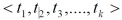

## CLOUD ALS REC

**基于隐语义模型的协同过滤推荐**

此模块基于隐语义模型的协同过滤算法，根据数据库中的用户对各产品的评分，计算非实时的商品推荐列表和各商品相似度矩阵。

### ALS

“ALS是一种协同算法，其全称是交替最小二乘法（Alternating Least Squares），由于简单高效，已被广泛应用在推荐场景中，目前已经被集成到Spark MLlib和ML库中。”

#### **ALS在推荐系统中的应用**

根绝协同过滤的思想，R矩阵的行向量对应每个用户U，列向量对应每个物品V。ALS的核心思想是：将用户和物品都投射到k维空间，将每个用户和每个物品都用k维的向量来表示，把他们的内积近似为打分值，这样便可以得到近似的评分。

![[公式]](https://www.zhihu.com/equation?tex=R+%5Capprox+UV%5ET+%5C%5C)

其中：

- R为打分矩阵（m*n表示用户个数，n表示物品个数)
- U表示用户对隐含特征的偏好矩阵（m*K)
-  V表示物品对隐含特征的归属矩阵（n*K)

上述模型的参数就是 U 和 V，求得 U 和 V 之后，就可以近似的得到用户对未评分物品的评分。

#### **代价函数**

本推荐系统基于已经存在的电商项目的评分模块，可以得到用户对物品明显的评价数据，仅以有评分行为的物品去计算误差，代价函数为**显式反馈函数**。

![[公式]](https://www.zhihu.com/equation?tex=J%28U%2CV%29+%3D+%5Csum_%7Bi%7D%5E%7Bm%7D+%5Csum_%7Bj%7D%5E%7Bn%7D%5B%28r_%7Bij%7D+-+u_iv_j%5ET%29+%5E2+%2B+%5Clambda+%28+%7C%7Cu_i%7C%7C%5E2+%2B+%7C%7Cv_j%7C%7C%5E2+%29+%5D+%5C%5C)

#### 参数取值

如何寻找适合的隐语义模型的rank,iterations,lambda三个参数？通常的做法是计算均方根误差（RMSE），考察预测评分与实际评分之间的误差。

​ 

有了RMSE，我们可以就可以通过多次调整参数值，来选取RMSE最小的一组作为我们模型的优化选择。

#### Spark中实现

Spark中ALS的api为：

```scala
ALS.train( alsTrainedData, rank, iterations, lambda )

```

**alsTrainedData:**

训练集，数据格式为：

```
org.apache.spark.rdd.RDD[org.apache.spark.mllib.recommendation.Rating]
```

**rank:**

特征向量维度，数据格式为：

```
scala.Int
```

**iterations:**

循环次数，数据格式为：

```
scala.Int
```

**lambda：**

正则化系数，数据格式为：

```
scala.Double
```

**返回**格式为：

```
org.apache.spark.mllib.recommendation.MatrixFactorizationModel
```


### RMSE

基于RMSE获取合适的ALS算法参数。

**主要步骤**

计算RMSE：

```scala
  val userProducts = data.map(item => (item.user,item.product))
  val predictRating = model.predict(userProducts)
val real = data.map(item => ((item.user,item.product),item.rating))
  val predict = predictRating.map(item => ((item.user,item.product),item.rating))
  // 计算RMSE
  sqrt(
    real.join(predict).map{case ((userId,productId),(real,pre))=>
      val err = real - pre
      err * err
    }.mean()
  )
```

获取合适的参数：

```scala
  val result = for(rank <- Array(100,200,250); lambda <- Array(1, 0.1, 0.01, 0.001))
    yield {
      val model = ALS.train(trainData,rank,10,lambda)
      val rmse = getRMSE(model, testData)
      (rank,lambda,rmse)
    }
```


### CLOUD_REC_USER

获取的用户推荐集合。统计每个商品对用户的期望评分值。该集合可以直接作为离线推荐数据。

集合**格式**：(id,[{"productId": new NumberInt("x1"), "score": x2}...],userId)

**数据集格式：**

```scala
val alsTrainedData = ratingRDD.map(x=>Rating(x._1,x._2,x._3))
```

通过对userId和productId做笛卡尔积，产生数据集。

**训练模型：**

```scala
val model = ALS.train( alsTrainedData, rank, iterations, lambda )
```

通过ALS算法获取训练模型。

**预测评分：**

```scala
val userProducts = userRDD.cartesian(productRDD)
val preRating = model.predict(userProducts)
```

调用model的predict方法获取预测评分矩阵。

**处理数据：**

```scala
    val userRecs = preRating.filter(_.rating>0)
      .map(
        rating => ( rating.user, ( rating.product, rating.rating ) )
      )
      .groupByKey()
      .map{
        case (userId, recs) =>
          Cloud_Rec_User( userId, recs.toList.sortWith(_._2>_._2).take(CLOUD_REC_USER_MAX_LENGTH).map(x=>Recommendation(x._1,x._2)) )
      }
      .toDF()
    userRecs.write
      .option("uri", mongoConfig.uri)
      .option("collection", DB_CLOUD_REC_USER_COLLECTION_NAME)
      .mode("overwrite")
      .format("com.mongodb.spark.sql")
      .save()
```

格式化数据并保存至数据库中。


### CLOUD_SIMILARITY_PRODUCT

获取的商品相似度矩阵。该矩阵用于查询当前商品的相似商品并为实时推荐系统服务。

#### 主要思想

离线计算的ALS 算法，算法最终会为用户、商品分别生成最终的特征矩阵，分别是表示用户特征矩阵的U(m x k)矩阵，每个用户由 k个特征描述；表示物品特征矩阵的V(n x k)矩阵，每个物品也由 k 个特征描述。

V(n x k)表示物品特征矩阵，每一行是一个 k 维向量，虽然我们并不知道每一个维度的特征意义是什么，但是k 个维度的数学向量表示了该行对应商品的特征。

所以，每个商品用V(n x k)每一行的向量表示其特征，于是任意两个商品 p：特征向量为，商品q：特征向量为之间的相似度sim(p,q)可以使用和的余弦值来表示：

 

数据集中任意两个商品间相似度都可以由公式计算得到，商品与商品之间的相似度在一段时间内基本是固定值。

#### 实现步骤

**计算相似度列表**

```scala
val productFeatures = model.productFeatures.map{
    case (productId, features) => ( productId, new DoubleMatrix(features) )
}
```

**计算余弦相似度**

```scala

    val productRecs = productFeatures.cartesian(productFeatures)
      .filter{
        case (a, b) => a._1 != b._1
      }
      .map{
        case (a, b) =>
          val simScore = (a._2).dot(b._2)/ ( (a._2).norm2() * (b._2).norm2() )
          ( a._1, ( b._1, simScore ) )
      }
      .filter(_._2._2 > 0.4)
      .groupByKey()
      .map{
        case (productId, recs) =>
          Cloud_Similarity_Product( productId, recs.toList.sortWith(_._2>_._2).map(x=>Recommendation(x._1,x._2)) )
      }
      .toDF()
```

**数据处理**

```scala
    productRecs.write
      .option("uri", mongoConfig.uri)
      .option("collection", DB_CLOUD_SIMILARITY_PRODUCT_COLLECTION_NAME)
      .mode("overwrite")
      .format("com.mongodb.spark.sql")
      .save()
```

